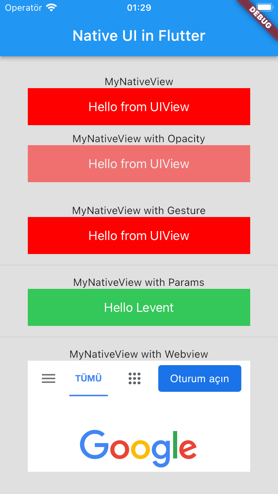

# Displaying iOS Native Views in Flutter

It is possible to embed native views into Flutter Apps.

## Description

For this example; five iOS view widgets are located to main.dart file.
1. view (main.dart) -> FLNativeView.swift
2. viewWithOpacity (main.dart) -> FLNativeView.swift
3. viewWithGesture (main.dart) -> FLNativeView.swift
4. viewWithParams (main.dart) -> FLNativeViewWithParams.swift
5. viewWithWebview (main.dart) -> FLNativeViewWithParams.swift

